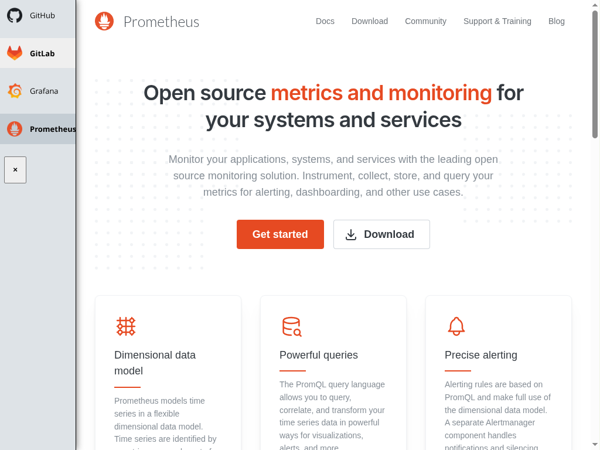
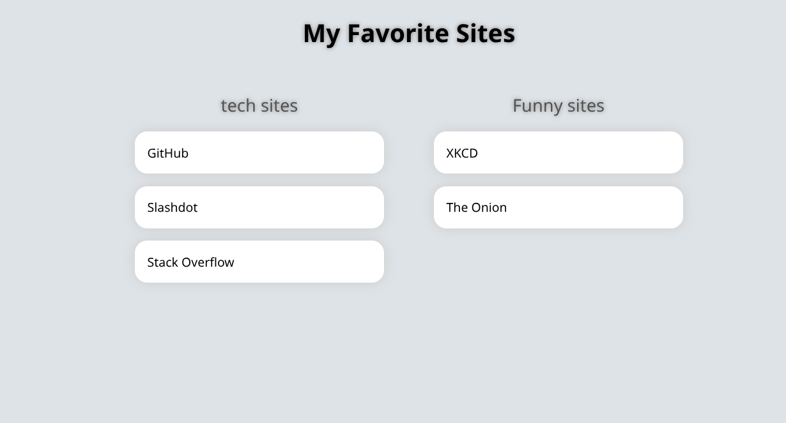
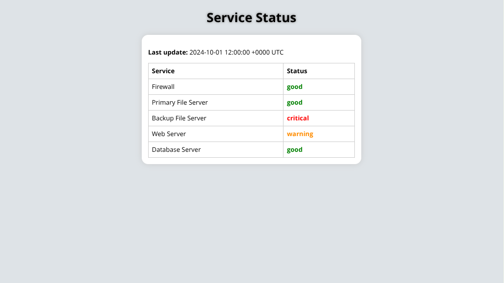

  
  <h1>StencilBox</h1>

Build data driven super speedy simple static sites, with sleek templates.

* [Use Cases](#use-cases)
* [Screenshots](#screenshots)
* [Installation Guide & Documentation](#installation-guide--documentation)
* [No-Nonsense Software Principles](#no-nonsense-software-principles)
* [AI usage declaration](#ai-usage-declaration)

## Use cases

### What can I use StencilBox for?

* **As a self hoster**, I want a "homepage" of links that I can easily update from YAML, and loads super duper quickly in the browser.
* **As a sysadmin**, I want to give my users who can understand a YAML file a simple way to create pages without needing to know about Git, worry about tooling, or hosting.
* **As a developer**, I want data in YAML format to be rendered to a nice looking webpage (eg: XSLT).

See the **Screenshots** for 3 more examples of pages built with StencilBox.

### FAQ

How does it compare to heimdall, homepage, and other similar tools?

StencilBox is similar in concept to those tools, with the following differences that might be seen as an advantage;

* **Static site generation** - means that pages are generated once, and images, assets, etc can be optimized. This means no scripts running in the browser. This means that pages are extremely fast to load.
* **Multiple build configs** - StencilBox can build multiple sites, meaning you can create a simple homepage for family, another homepage for friends, and another for you - without needing to run multiple containers.
* **Not just for links** - StencilBox is not just for links, it can render any data you want, from YAML files. This means you can create a simple static page with any content you want, and it will be rendered as a static page. Those other tools focus heavily on being homepages only.

  
How does it compare to Hugo, Jekyll, and other static site generators?

  StencilBox is also very similar in concept to many other static site generators, but it's focus on YAML data files and providing a simple repeatable workflow for multiple sites is a key difference. 

Many other tools are focussed on text content (typically via Markdown) - which is geat for public websites, blogs and similar. StencilBox doesn't support Markdown (yet), and it's main purpose is to turn data into sites, rather than content. Hugo and Jekyll **can do this**, they're excellent tools, but StencilBox was built after trying to use those tools and finding them too complex for the simple use cases StencilBox targets.

## Screenshots

The admin interface, showing the build configs: 

<strong>Example 1:</strong> A sidebar of links, generated from template: <strong><a href = "https://jamesread.github.io/StencilBox/builtin-templates/iframe-sidebar.html">iframe-sidebar</strong></a> 

<strong>Example 2:</strong> A homepage of links, generated from template: <strong><a href = "https://jamesread.github.io/StencilBox/builtin-templates/links-homepage.html">links-homepage</strong></a> 

<strong>Example 3:</strong> status page, generated from template: <strong><a href = "https://jamesread.github.io/StencilBox/builtin-templates/status-page.html">status-page</strong></a> 

## Installation Guide & Documentation

The StencilBox docs can all be found here; [Installation Guide & Documentation](https://jamesread.github.io/StencilBox/index.html)

## No-Nonsense Software Principles

StencilBox follows these principles:

* **Open Source & Free Software**: following the [Open Source Definition](https://opensource.org/osd) and the [Free Software Definition](https://www.gnu.org/philosophy/free-sw.html). All code and assets are available under the [AGPL-3.0 License](LICENSE).
* **Independent**: No company owns the code or is responsible for the projects' governance.
* **Inclusive**: No "core", "pro", "premium" or "enterprise" version. The only version is the one you can download and run, and it has all the features.
* **Invisible**: No usage tracking, no user tracking, no ads, and no telemetry.
* **Internal**: No internet connection required for any functionality.

## AI usage declaration

This is a brief overview of the AI usage for the README. The full AI policy can be found in [AI.md](AI.md).

* **Runtime**: This project makes no usage of any AI models at runtime, no data of any kind is sent or received to any AI.
* **Development - Writing code**: This is a human written and maintained codebase. Humans may use AI code suggestions (1-3 lines or so) to speed up typing code a human would have written.
* **Development - Build pipeline**: Linters, code review tools, and others which areenabled by AI are allowed and encouraged, but as OPTIONAL tools. No part of the build process may DEPEND on AI tools (eg, code generation).
