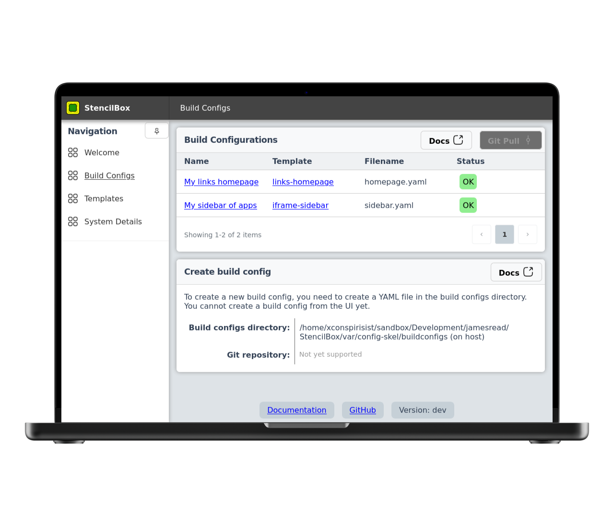

  
  <h1>StencilBox</h1>

Generate super speedy simple static sites, from sleek templates.

If you've ever used static site generators like Hugo, this is very similar. The emphesis of this is for the self hosted community. Think sidebars, static links pages, etc.

* [Use Cases](#use-cases)
* [Screenshots](#screenshots)
* [Installation Guide & Documentation](#installation-guide--documentation)
* [No-Nonsense Software Principles](#no-nonsense-software-principles)
* [AI usage declaration](#ai-usage-declaration)

## Use cases

### What can I use StencilBox for?

* Static pages are built once, and then served extremely quickly from a web server (optionally from the webserver built-in to StencilBox).
* Build multiple static sites from a simple directory of configs, or even multiple Git repositories.
* Administrators can give an "easy button" to users to create a static page, without needing to know how to use Git or a static site generator.
* Opt in to GitOps to build your pages, without the pain of external build and hosting tools.

### What should I not use StencilBox for?

* StencilBox is very similar to Hugo, Jekyll, and other static site generators. However those are tailored for public websites, blogs, and other content that is meant to be shared with the world. StencilBox is meant for internal use, and is not a replacement for those tools.

## Installation Guide & Documentation

The StencilBox docs can all be found here; [Installation Guide & Documentation](https://jamesread.github.io/StencilBox/index.html)

## Screenshots

## No-Nonsense Software Principles

StencilBox follows these principles:

* **Open Source & Free Software**: following the [Open Source Definition](https://opensource.org/osd) and the [Free Software Definition](https://www.gnu.org/philosophy/free-sw.html). All code and assets are available under the [AGPL-3.0 License](LICENSE).
* **Independent**: No company owns the code or is responsible for the projects' governance.
* **Inclusive**: No "core", "pro", "premium" or "enterprise" version. The only version is the one you can download and run, and it has all the features.
* **Invisible**: No usage tracking, no user tracking, no ads, and no telemetry.
* **Internal**: No internet connection required for any functionality.

## AI usage declaration

This is a brief overview of the AI usage for the README. The full AI policy can be found in [AI.md](AI.md).

* **Runtime**: This project makes no usage of any AI models at runtime, no data of any kind is sent or received to any AI.
* **Development - Writing code**: This is a human written and maintained codebase. Humans may use AI code suggestions (1-3 lines or so) to speed up typing code a human would have written.
* **Development - Build pipeline**: Linters, code review tools, and others which areenabled by AI are allowed and encouraged, but as OPTIONAL tools. No part of the build process may DEPEND on AI tools (eg, code generation).
