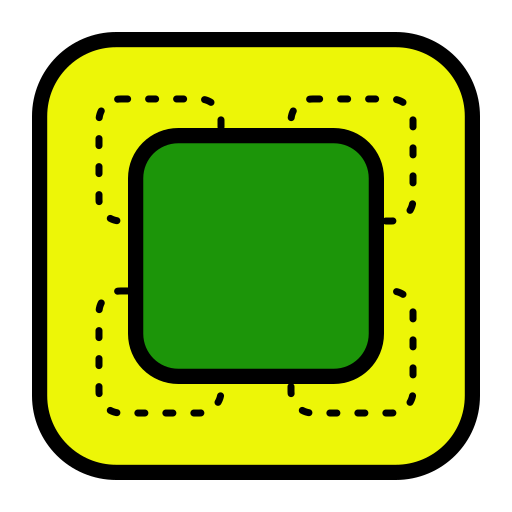
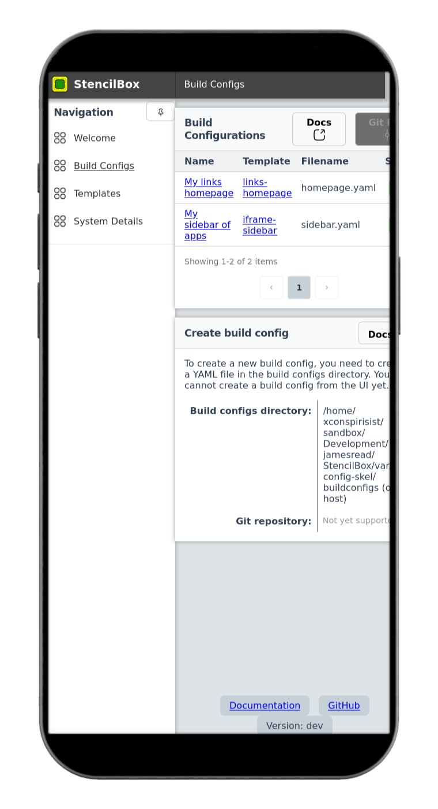

  
  <h1>StencilBox v2</h1>

Generate super speedy simple static sites, from sleek templates.

If you've ever used static site generators like Hugo, this is very similar. The emphesis of this is for the self hosted community. Think sidebars, static links pages, etc.

## Screenshots

